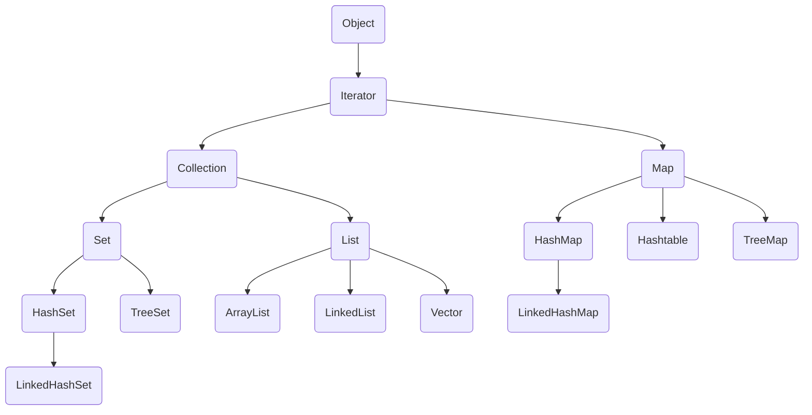

## 前言

几乎所有的java面试都会问到关于集合的问题，事实上，正确的选择集合去存储数据能有效的提升我们程序的执行效率，我们今天就来捋一捋集合中一些常见的集合类它们的实现原理。（结合部分源码）

### 目录



可以看到，集合在java中大体分为三大类：

- List
- Set
- Map

 那么，接下来的分析，我们就按照以上类别依次分析。


### List系列

关于这个系列，相信是大家使用的最多的集合类，下面我们依次来分析一下它们的实现原理。

#### ArrayList

ArrayList内部其实是由数组实现的，我们可以在源码中看到

```
transient Object[] elementData; 
```


并且，如果我们不给它分配初始大小，它默认大小为0。我们如果我们分配了大小，那么初始大小就是我们分配的大小值。从下面的代码可以看出

```
    private static final Object[] DEFAULTCAPACITY_EMPTY_ELEMENTDATA = {};

    transient Object[] elementData;
    
    public ArrayList() {
        this.elementData = DEFAULTCAPACITY_EMPTY_ELEMENTDATA;
    }
    
    public ArrayList(int initialCapacity) {
        if (initialCapacity > 0) {
            this.elementData = new Object[initialCapacity];
        } else if (initialCapacity == 0) {
            this.elementData = EMPTY_ELEMENTDATA;
        } else {
            throw new IllegalArgumentException("Illegal Capacity: "+initialCapacity);
        }
    }
```

初始化完成后，我们一般的操作就是新增元素了，在元素总数不超过数组长度时，都很好理解，直接在添加到数组里面即可。但是，如果长度不够了咋办，比如，我们直接初始化的话，容量大小就等于0了，而且java里面的数组长度一旦写死，就无法修改了，那么官方是怎么做的呢？我们直接根据源码来解析吧。

我们先看它的add方法

```
    private static final int DEFAULT_CAPACITY = 10;

    private int size;

    public boolean add(E e) {
        //传入现在需要的容量大小
        ensureCapacityInternal(size + 1);  // Increments modCount!!
        //写入新的元素到数组里面
        elementData[size++] = e;
        return true;
    }

    private void ensureCapacityInternal(int minCapacity) {
        //判断当前的数组是否为初始化的空数组
        if (elementData == DEFAULTCAPACITY_EMPTY_ELEMENTDATA) {
            //如果是空数组，就将容量修改为10
            minCapacity = Math.max(DEFAULT_CAPACITY, minCapacity);
        }
        ensureExplicitCapacity(minCapacity);
    }
```

我们可以看到，它首先判断是否是初始化的空数组，如果是的就给个默认容量10，然后就到了ensureExplicitCapacity方法，我们接着看

```
    private void ensureExplicitCapacity(int minCapacity) {
        modCount++;
        // 这里比较我们需要的最小容量和当前容量的大小，如果容量不过，就扩展数组大小
        if (minCapacity - elementData.length > 0)
            grow(minCapacity);
    }
    
    private static final int MAX_ARRAY_SIZE = Integer.MAX_VALUE - 8;
    
    private void grow(int minCapacity) {
        // 记录旧的数组长度
        int oldCapacity = elementData.length;
        //新的容量大小为旧的长度*1.5
        int newCapacity = oldCapacity + (oldCapacity >> 1);
        //如果新的容量还是小于我们需要的最小容量，那么，就把新的容量的值修改为我们需要的最小容量
        if (newCapacity - minCapacity < 0)
            newCapacity = minCapacity;
        //如果修改之后的新的容量的大小大于Integer.MAX_VALUE - 8
        if (newCapacity - MAX_ARRAY_SIZE > 0)
            //这个方法就是把容量大小改为Integer.MAX_VALUE
            newCapacity = hugeCapacity(minCapacity);
        //调用底层的API扩展当前数组的大小
        elementData = Arrays.copyOf(elementData, newCapacity);
    }
    
    private static int hugeCapacity(int minCapacity) {
        if (minCapacity < 0) // overflow
            throw new OutOfMemoryError();
        return (minCapacity > MAX_ARRAY_SIZE) ?
            Integer.MAX_VALUE :
            MAX_ARRAY_SIZE;
    }
```

在这个方法里面，我们了解到，每次增加的容量为原来容量的一半，当然，如果接近Int的最大值的时候，我们就需要做一些处理了。


了解完新增的原理之后，我们来看看它的删除的原理

```
   //根据元素删除
   public boolean remove(Object o) {
        //这里我们需要判断一个这个对象是否为null，需要分开处理，因为null无法调用equals方法
        if (o == null) {
            for (int index = 0; index < size; index++)
                if (elementData[index] == null) {
                    //直接循环找到第一个符合的元素的下标，然后删除它
                    fastRemove(index);
                    return true;
                }
        } else {
            for (int index = 0; index < size; index++)
                if (o.equals(elementData[index])) {
                    //直接循环找到第一个符合的元素，然后删除它
                    fastRemove(index);
                    return true;
                }
        }
        return false;
    }
    
    //根据下标删除
    private void fastRemove(int index) {
        modCount++;
        //这里得到删除的位置用以判断是否是删除的最后一个元素
        int numMoved = size - index - 1;
        if (numMoved > 0)
            //不是最后一个元素时，将这个下标之后的元素全部往前移一位
            System.arraycopy(elementData, index+1, elementData, index,
                             numMoved);
        //如果是最后一位，直接删除，并释放内存。
        elementData[--size] = null; // clear to let GC do its work
    }
```

这里可以看到非常细节的一个操作，就是遍历的时候区分null，同时这里也告诉我们，ArrayList是可以存入null值的。


### Set系列


#### Map系列

分析这个之前，我们需要了解很多一些基础知识。

#### 什么是 “链表散列”？

哈希表（Hash table，也叫散列表），是根据关键码值(Key value)而直接进行访问的数据结构。也就是说，它通过把关键码值映射到表中一个位置来访问记录，以加快查找的速度。这个映射函数叫做散列函数，存放记录的数组叫做散列表。

记录的存储位置=f(关键字)

这里的对应关系f称为散列函数，又称为哈希（Hash函数），采用散列技术将记录存储在一块连续的存储空间中，这块连续存储空间称为散列表或哈希表（Hash table）。

哈希表hashtable(key，value) 就是把Key通过一个固定的算法函数既所谓的哈希函数转换成一个整型数字，然后就将该数字对数组长度进行取余，取余结果就当作数组的下标，将value存储在以该数字为下标的数组空间里。（或者：把任意长度的输入（又叫做预映射， pre-image），通过散列算法，变换成固定长度的输出，该输出就是散列值。这种转换是一种压缩映射，也就是，散列值的空间通常远小于输入的空间，不同的输入可能会散列成相同的输出，而不可能从散列值来唯一的确定输入值。简单的说就是一种将任意长度的消息压缩到某一固定长度的消息摘要的函数。）
    而当使用哈希表进行查询的时候，就是再次使用哈希函数将key转换为对应的数组下标，并定位到该空间获取value，如此一来，就可以充分利用到数组的定位性能进行数据定位。

数组的特点是：寻址容易，插入和删除困难；

而链表的特点是：寻址困难，插入和删除容易。

那么我们能不能综合两者的特性，做出一种寻址容易，插入删除也容易的数据结构？答案是肯定的，这就是我们要提起的哈希表，哈希表有多种不同的实现方法，我接下来解释的是最常用的一种方法——拉链法，我们可以理解为“链表的数组”，如图：


左边很明显是个数组，数组的每个成员包括一个指针，指向一个链表的头，当然这个链表可能为空，也可能元素很多。我们根据元素的一些特征把元素分配到不同的链表中去，也是根据这些特征，找到正确的链表，再从链表中找出这个元素。

谈谈我现在的理解，我理解的Hashmap是一个数组带链表，当有key-value进来时，首先得到key的hashcode值，例如：19，然后根据hashmap的容量计算放置的位置，如容量为9，那么计算的结果就为 19%9 = 1，放置的位置就是数组的下标为1的位置。0这个位置是放置key为null的key-value对象。那么现在就会出现一个问题，如果，我们的key为10，经过计算得到10%9 = 1，现在，问题就出现了，位置也是1，那么怎么存放，直接存放会导致之前的数据丢失，但是又不能不存放，这就是典型的hasn冲突了，那么怎么解决咧？我们看看一下几种方式：


- 1.开放定址法：这种方法也称再散列法，其基本思想是：当关键字key的哈希地址p=H（key）出现冲突时，以p为基础，产生另一个哈希地址p1，如果p1仍然冲突，再以p为基础，产生另一个哈希地址p2，…，直到找出一个不冲突的哈希地址pi ，将相应元素存入其中。这种方法有一个通用的再散列函数形式：

```
Hi=（H（key）+di）% m i=1，2，…，n
```

其中H（key）为哈希函数，m 为表长，di称为增量序列。增量序列的取值方式不同，相应的再散列方式也不同。主要有以下三种：

- 线性探测再散列

```
dii=1，2，3，…，m-1
```

这种方法的特点是：冲突发生时，顺序查看表中下一单元，直到找出一个空单元或查遍全表。

- 二次探测再散列

di=12，-12，22，-22，…，k2，-k2 ( k<=m/2 )

这种方法的特点是：冲突发生时，在表的左右进行跳跃式探测，比较灵活。

伪随机探测再散列

di=伪随机数序列。

具体实现时，应建立一个伪随机数发生器，（如i=(i+p) % m），并给定一个随机数做起点。

例如，已知哈希表长度m=11，哈希函数为：H（key）= key % 11，则H（47）=3，H（26）=4，H（60）=5，假设下一个关键字为69，则H（69）=3，与47冲突。

如果用线性探测再散列处理冲突，下一个哈希地址为H1=（3 + 1）% 11 = 4，仍然冲突，再找下一个哈希地址为H2=（3 + 2）% 11 = 5，还是冲突，继续找下一个哈希地址为H3=（3 + 3）% 11 = 6，此时不再冲突，将69填入5号单元。

如果用二次探测再散列处理冲突，下一个哈希地址为H1=（3 + 12）% 11 = 4，仍然冲突，再找下一个哈希地址为H2=（3 - 12）% 11 = 2，此时不再冲突，将69填入2号单元。

如果用伪随机探测再散列处理冲突，且伪随机数序列为：2，5，9，……..，则下一个哈希地址为H1=（3 + 2）% 11 = 5，仍然冲突，再找下一个哈希地址为H2=（3 + 5）% 11 = 8，此时不再冲突，将69填入8号单元。


- 2.再哈希法
  这种方法是同时构造多个不同的哈希函数：

Hi=RH1（key） i=1，2，…，k

当哈希地址Hi=RH1（key）发生冲突时，再计算Hi=RH2（key）……，直到冲突不再产生。这种方法不易产生聚集，但增加了计算时间。


- 3.链地址法
  这种方法的基本思想是将所有哈希地址为i的元素构成一个称为同义词链的单链表，并将单链表的头指针存在哈希表的第i个单元中，因而查找、插入和删除主要在同义词链中进行。链地址法适用于经常进行插入和删除的情况。


- 4.建立公共溢出区
  这种方法的基本思想是：将哈希表分为基本表和溢出表两部分，凡是和基本表发生冲突的元素，一律填入溢出表。

#### 拉链法与开放地址法相比的缺点：

##### 拉链法的优点

与开放定址法相比，拉链法有如下几个优点：

①拉链法处理冲突简单，且无堆积现象，即非同义词决不会发生冲突，因此平均查找长度较短；

②由于拉链法中各链表上的结点空间是动态申请的，故它更适合于造表前无法确定表长的情况；

③开放定址法为减少冲突，要求装填因子α较小，故当结点规模较大时会浪费很多空间。而拉链法中可取α≥1，且结点较大时，拉链法中增加的指针域可忽略不计，因此节省空间；

④在用拉链法构造的散列表中，删除结点的操作易于实现。只要简单地删去链表上相应的结点即可。而对开放地址法构造的散列表，删除结点不能简单地将被删结 点的空间置为空，否则将截断在它之后填人散列表的同义词结点的查找路径。这是因为各种开放地址法中，空地址单元(即开放地址)都是查找失败的条件。因此在 用开放地址法处理冲突的散列表上执行删除操作，只能在被删结点上做删除标记，而不能真正删除结点。


##### 拉链法的缺点

　拉链法的缺点是：指针需要额外的空间，故当结点规模较小时，开放定址法较为节省空间，而若将节省的指针空间用来扩大散列表的规模，可使装填因子变小，这又减少了开放定址法中的冲突，从而提高平均查找速度。

结合上面所说的和hashmap的源码，我们重点关注拉链法，我们冲突的元素会放置在对应位置的链表的最后面，这样子，查询的时候，只需要一遍就可以查到结果了。


HashMap实际上是一个“链表散列”的数据结构，即数组和链表的结合体。那么问题来了？

#### 关于hasnmap的源码

大概看了一下，估摸着有点难理解，后面再补上

#### 容错机制

因为hashmap是非线程安全的，所以有时候出现多个线程操作的时候，容易导致数据混乱，所以，里面添加了一个容错机制---Fail-Fast 机制

##### Fail-Fast 机制

我们知道 java.util.HashMap 不是线程安全的，因此如果在使用迭代器的过程中有其他线程修改了 map，那么将抛出 ConcurrentModificationException，这就是所谓 fail-fast 策略。

ail-fast 机制是 java 集合(Collection)中的一种错误机制。 当多个线程对同一个集合的内容进行操作时，就可能会产生 fail-fast 事件。

例如：当某一个线程 A 通过 iterator去遍历某集合的过程中，若该集合的内容被其他线程所改变了；那么线程 A 访问集合时，就会抛出 ConcurrentModificationException 异常，产生 fail-fast 事件。

这一策略在源码中的实现是通过 modCount 域，modCount 顾名思义就是修改次数，对 HashMap 内容（当然不仅仅是 HashMap 才会有，其他例如 ArrayList 也会）的修改都将增加这个值（大家可以再回头看一下其源码，在很多操作中都有 modCount++ 这句），那么在迭代器初始化过程中会将这个值赋给迭代器的 expectedModCount。

```
HashIterator() {
    expectedModCount = modCount;
    if (size > 0) { // advance to first entry
    Entry[] t = table;
    while (index < t.length && (next = t[index++]) == null)  
        ;
    }
}
```

在迭代过程中，判断 modCount 跟 expectedModCount 是否相等，如果不相等就表示已经有其他线程修改了 Map：

注意到 modCount 声明为 volatile，保证线程之间修改的可见性。

```
final Entry<K,V> nextEntry() {
    if (modCount != expectedModCount)
        throw new ConcurrentModificationException();
```

在 HashMap 的 API 中指出：

由所有 HashMap 类的“collection 视图方法”所返回的迭代器都是快速失败的：在迭代器创建之后，如果从结构上对映射进行修改，除非通过迭代器本身的 remove 方法，其他任何时间任何方式的修改，迭代器都将抛出 ConcurrentModificationException。因此，面对并发的修改，迭代器很快就会完全失败，而不冒在将来不确定的时间发生任意不确定行为的风险。

注意，迭代器的快速失败行为不能得到保证，一般来说，存在非同步的并发修改时，不可能作出任何坚决的保证。快速失败迭代器尽最大努力抛出 ConcurrentModificationException。因此，编写依赖于此异常的程序的做法是错误的，正确做法是：迭代器的快速失败行为应该仅用于检测程序错误。

解决方案
在上文中也提到，fail-fast 机制，是一种错误检测机制。它只能被用来检测错误，因为 JDK 并不保证 fail-fast 机制一定会发生。若在多线程环境下使用 fail-fast 机制的集合，建议使用“java.util.concurrent 包下的类”去取代“java.util 包下的类”。

HashMap 的两种遍历方式
第一种

```
　　Map map = new HashMap();
　　Iterator iter = map.entrySet().iterator();
　　while (iter.hasNext()) {
　　Map.Entry entry = (Map.Entry) iter.next();
　　Object key = entry.getKey();
　　Object val = entry.getValue();
　　}
```

效率高,以后一定要使用此种方式！

第二种

```
　　Map map = new HashMap();
　　Iterator iter = map.keySet().iterator();
　　while (iter.hasNext()) {
　　Object key = iter.next();
　　Object val = map.get(key);
　　}
```

效率低,以后尽量少使用！


### HashMap 和 HashTable 区别

HashMap 不是线程安全的
HashMap 是 map 接口的实现类，是将键映射到值的对象，其中键和值都是对象，并且不能包含重复键，但可以包含重复值。HashMap 允许 null key 和 null value，而 HashTable 不允许。

HashTable 是线程安全 Collection。
HashMap 是 HashTable 的轻量级实现，他们都完成了Map 接口，主要区别在于 HashMap 允许 null key 和 null value,由于非线程安全，效率上可能高于 Hashtable。

区别如下：
HashMap允许将 null 作为一个 entry 的 key 或者 value，而 Hashtable 不允许。
HashMap 把 Hashtable 的 contains 方法去掉了，改成 containsValue 和 containsKey。因为 contains 方法容易让人引起误解。
HashTable 继承自 Dictionary 类，而 HashMap 是 Java1.2 引进的 Map interface 的一个实现。
HashTable 的方法是 Synchronize 的，而 HashMap 不是，在多个线程访问 Hashtable 时，不需要自己为它的方法实现同步，而 HashMap 就必须为之提供外同步。
Hashtable 和 HashMap 采用的 hash/rehash 算法都大概一样，所以性能不会有很大的差异。

### LinkedHashMap

LinkedHashMap 概述
HashMap 是无序的，HashMap 在 put 的时候是根据 key 的 hashcode 进行 hash 然后放入对应的地方。所以在按照一定顺序 put 进 HashMap 中，然后遍历出 HashMap 的顺序跟 put 的顺序不同（除非在 put 的时候 key 已经按照 hashcode 排序号了，这种几率非常小）

JAVA 在 JDK1.4 以后提供了 LinkedHashMap 来帮助我们实现了有序的 HashMap！

LinkedHashMap 是 HashMap 的一个子类，它保留插入的顺序，如果需要输出的顺序和输入时的相同，那么就选用 LinkedHashMap。

LinkedHashMap 是 Map 接口的哈希表和链接列表实现，具有可预知的迭代顺序。此实现提供所有可选的映射操作，并允许使用 null 值和 null 键。此类不保证映射的顺序，特别是它不保证该顺序恒久不变。

LinkedHashMap 实现与 HashMap 的不同之处在于，LinkedHashMap 维护着一个运行于所有条目的双重链接列表。此链接列表定义了迭代顺序，该迭代顺序可以是插入顺序或者是访问顺序。

注意，此实现不是同步的。如果多个线程同时访问链接的哈希映射，而其中至少一个线程从结构上修改了该映射，则它必须保持外部同步。

根据链表中元素的顺序可以分为：按插入顺序的链表，和按访问顺序(调用 get 方法)的链表。默认是按插入顺序排序，如果指定按访问顺序排序，那么调用get方法后，会将这次访问的元素移至链表尾部，不断访问可以形成按访问顺序排序的链表。

对于这个类，我的理解为，在hashmap的基础上，把每次添加的节点封装为

```
    static class Entry<K,V> extends HashMap.Node<K,V> {
        Entry<K,V> before, after;
        Entry(int hash, K key, V value, Node<K,V> next) {
            super(hash, key, value, next);
        }
    }
```

可以看到，新增了before, after两个位置表示前后的位置，这样子，就实现了双向链表的操作。

其它的跟hashmap一样的

### HasnSet

內部就是使用hashmap实现的，但是，hasnmap是有key-value的，但是我们使用set只有一个参数，为啥列？我们可以看这个

```
    private static final Object PRESENT = new Object();

    public boolean add(E e) {
        return map.put(e, PRESENT)==null;
    }
```

我们可以看到，它把我们传入的参数当成key，value就是一个新的Object对象

### LinkedHashSet

这个类就是HashSet的子类，但是，HashSet内部是hashmap实现的，如果要一样的话，应该是LinkedHashMap实现的呀，但是，我们看看这个类的代码

```
public class LinkedHashSet<E>
    extends HashSet<E>
    implements Set<E>, Cloneable, java.io.Serializable {

    private static final long serialVersionUID = -2851667679971038690L;

    public LinkedHashSet(int initialCapacity, float loadFactor) {
        super(initialCapacity, loadFactor, true);
    }

    public LinkedHashSet(int initialCapacity) {
        super(initialCapacity, .75f, true);
    }

    public LinkedHashSet() {
        super(16, .75f, true);
    }

    public LinkedHashSet(Collection<? extends E> c) {
        super(Math.max(2*c.size(), 11), .75f, true);
        addAll(c);
    }

    @Override
    public Spliterator<E> spliterator() {
        return Spliterators.spliterator(this, Spliterator.DISTINCT | Spliterator.ORDERED);
    }
}

```

恩？？？？没有LinkedHashMap呀，莫慌，我们点击

```
 super(16, .75f, true);  
```

可以看到

```
    HashSet(int initialCapacity, float loadFactor, boolean dummy) {
        map = new LinkedHashMap<>(initialCapacity, loadFactor);
    }
```

是吧，还是和LinkedHsahMap的实现原理一样的

### TreeSet


### 什么是迭代器

迭代器是一种设计模式，它是一个对象，它可以遍历并选择序列中的对象，而开发人员不需要了解该序列的底层结构。迭代器通常被称为“轻量级”对象，因为创建它的代价小。

##### Java中的Iterator功能比较简单，并且只能单向移动：

- (1) 使用方法iterator()要求容器返回一个Iterator。第一次调用Iterator的next()方法时，它返回序列的第一个元素。注意：iterator()方法是java.lang.Iterable接口,被Collection继承。

- (2) 使用next()获得序列中的下一个元素。

- (3) 使用hasNext()检查序列中是否还有元素。

- (4) 使用remove()将迭代器新返回的元素删除。

举个栗子：

```
public class Muster {
 
    public static void main(String[] args) {
        ArrayList list = new ArrayList();
        list.add("a");
        list.add("b");
        list.add("c");
        Iterator it = list.iterator();
        while(it.hasNext()){
            String str = (String) it.next();
            System.out.println(str);
        }
    }
}
```

运行结果：

```
a
b
c
```

可以看到，Iterator可以不用管底层数据具体是怎样存储的，都能够通过next()遍历整个List。

但是，具体是怎么实现的呢？背后机制究竟如何呢？

### 源码解读

这里我们来看看Java里AbstractList实现Iterator的源代码：

```
public abstract class AbstractList<E> extends AbstractCollection<E> implements List<E> { // List接口实现了Collection<E>, Iterable<E> 
  
    protected AbstractList() {  
    }  
    
    ...  
  
    public Iterator<E> iterator() {  
    return new Itr();  // 这里返回一个迭代器
    }  
  
    private class Itr implements Iterator<E> {  // 内部类Itr实现迭代器
       
    int cursor = 0;  
    int lastRet = -1;  
    int expectedModCount = modCount;    
    public boolean hasNext() {  // 实现hasNext方法
            return cursor != size();  
    }  
  
    public E next() {  // 实现next方法
            checkForComodification();  
       try {  
       E next = get(cursor);  
       lastRet = cursor++;  
       return next;  
       } catch (IndexOutOfBoundsException e) {  
        checkForComodification();  
        throw new NoSuchElementException();  
       }  
    }  
  
    public void remove() {  // 实现remove方法
        if (lastRet == -1)  
        throw new IllegalStateException();  
            checkForComodification();  
  
        try {  
        AbstractList.this.remove(lastRet);  
        if (lastRet < cursor)  
            cursor--;  
        lastRet = -1;  
        expectedModCount = modCount;  
        } catch (IndexOutOfBoundsException e) {  
        throw new ConcurrentModificationException();  
        }  
    }  
  
    final void checkForComodification() {  
        if (modCount != expectedModCount)  
        throw new ConcurrentModificationException();  
    }  
    }  
}
```

可以看到，实现next()是通过get(cursor)，然后cursor++，通过这样实现遍历。

这部分代码不难看懂，唯一难懂的是remove操作里涉及到的expectedModCount = modCount;

在网上查到说这是集合迭代中的一种“快速失败”机制，这种机制提供迭代过程中集合的安全性。
从源代码里可以看到增删操作都会使modCount++，通过和expectedModCount的对比，迭代器可以快速的知道迭代过程中是否存在list.add()类似的操作，存在的话快速失败!

举个栗子：

```
public class Muster {
 
    public static void main(String[] args) {
        ArrayList list = new ArrayList();
        list.add("a");
        list.add("b");
        list.add("c");
        Iterator it = list.iterator();
        while(it.hasNext()){
            String str = (String) it.next();
            System.out.println(str);
            list.add("s");        //添加一个add方法
        }
    }
}
```

运行结果：

```
a
Exception in thread "main" java.util.ConcurrentModificationException
　　at java.util.ArrayList$Itr.checkForComodification(Unknown Source)
　　at java.util.ArrayList$Itr.next(Unknown Source)
　　at com.hasse.Muster.main(Muster.java:11)
```

这就会抛出一个下面的异常，迭代终止。


#### 关于modCount，API解释如下：

```
The number of times this list has been structurally modified. Structural modifications are those that change the size of the list, or otherwise perturb it in such a fashion that iterations in progress may yield incorrect results.
```

也就是说，modCount记录修改此列表的次数：包括改变列表的结构，改变列表的大小，打乱列表的顺序等使正在进行迭代产生错误的结果。

##### Tips:仅仅设置元素的值并不是结构的修改

我们知道的是ArrayList是线程不安全的，如果在使用迭代器的过程中有其他的线程修改了List就会抛出ConcurrentModificationException，这就是Fail-Fast机制。